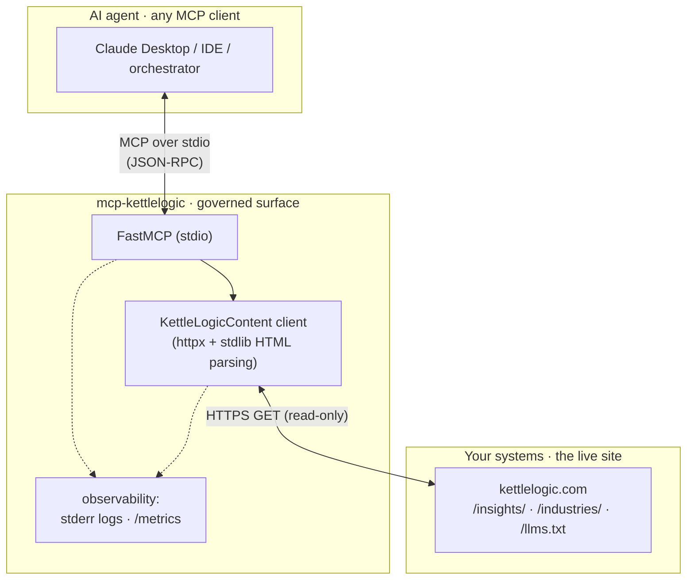
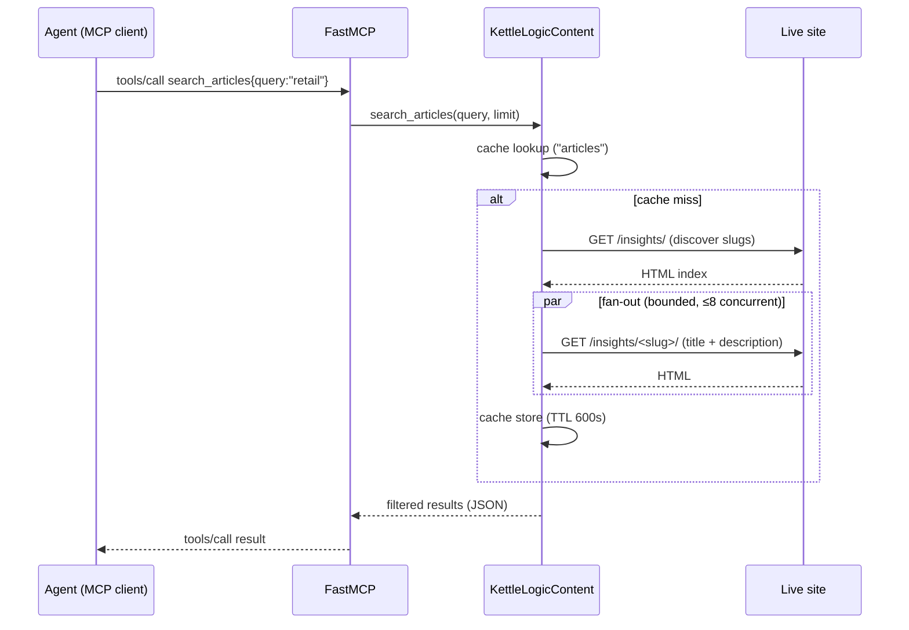

# Architecture

`mcp-kettlelogic` is a thin, stateless MCP server that turns a public Kettle Logic
website into an agent-consumable surface. It owns no data — every answer is derived
from a live fetch of the configured site.

## Three layers

- **Agent layer** — any MCP-compliant client. It speaks MCP; it doesn't know or care
  how the content is sourced.
- **MCP layer (this repo)** — the single governed surface for tools, resources and
  prompts. Stateless, read-only, no credentials.
- **Site layer** — the public website, selected by `KETTLELOGIC_BASE_URL`.

## Request flow

`get_industry_overview` and the `kettlelogic://articles/{slug}` resource follow the
same shape: fetch the page, extract readable text with the stdlib `HTMLParser`
(dropping `<script>`/`<style>`/`<nav>`/`<header>`/`<footer>`), return clean prose.

## Design decisions

- **Live, not bundled.** Content is fetched on demand so the server never drifts from
  the site. A short in-memory TTL cache (default 600s) keeps a burst of tool calls in
  one agent turn from re-crawling.
- **Configurable target.** `KETTLELOGIC_BASE_URL` makes the server a generic reader —
  point it at your own site. Industry discovery prefers the cross-site
  [`llms.txt`](https://llmstxt.org/) convention, falling back to crawling `/industries/`.
- **Standard library parsing.** No scraping framework; `html.parser.HTMLParser`
  subclasses extract links and readable text. Fewer dependencies, no brittle regex.
- **Official MCP SDK over stdio.** Correct, interoperable transport (newline-delimited
  JSON-RPC) — works with Claude Desktop and IDE clients out of the box.
- **Stateless & safe.** Read-only HTTP, no auth, no writes, bounded concurrency, and a
  cap on how many article pages it will fan out to (`MAX_ARTICLES`).
- **Observability built in.** All logs go to stderr (stdout is reserved for the MCP
  protocol); operations and fetches emit counters and latency summaries, optionally
  exposed as Prometheus metrics.

## Failure modes

| Condition | Behavior |
|-----------|----------|
| An article page fails to load | That article still appears in the manifest with a slug-derived title (degraded, not dropped). |
| Site has no `/llms.txt` | Industries are discovered by crawling `/industries/` instead. |
| Unknown industry slug (404) | Tool returns a clear `Unknown industry` error. |
| Site unreachable | Tool/resource returns an error; the server stays up for the next call. |
