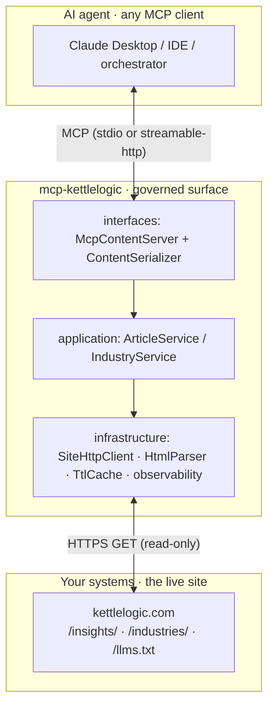
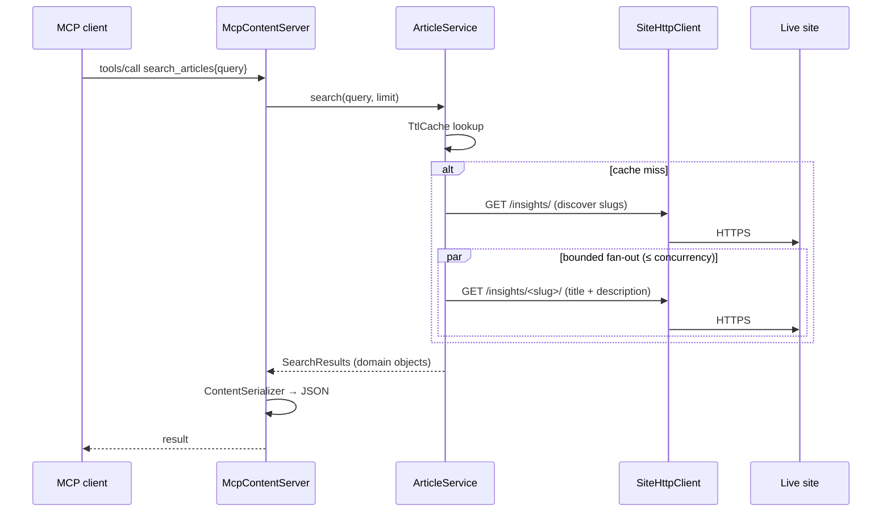

# Architecture

`mcp-kettlelogic` is a thin, stateless MCP server that turns a public Kettle Logic
website into an agent-consumable surface. It owns no data — every answer is derived
from a live fetch of the configured site — and it is organised as a small
**hexagonal (ports & adapters)** application so each concern is isolated and tested
in isolation.

## Layers

```
src/mcp_kettlelogic/
├── constants.py          # all literals (no magic numbers/strings in logic)
├── config.py             # ← the only reader of the environment
├── domain/               # enums, frozen value objects, errors (no I/O)
│   ├── enums.py          #   TransportKind, CacheOutcome
│   ├── models.py         #   ArticleSummary, ArticleContent, Industry, …
│   └── errors.py         #   FetchError, NotFoundError, UnknownIndustryError, …
├── infrastructure/       # adapters to the outside world
│   ├── http_client.py    #   ← the only place that touches the network (httpx)
│   ├── html_parsing.py   #   stdlib HTMLParser extractors + text normalizer
│   ├── cache.py          #   TtlCache
│   └── observability.py  #   logging, metrics registry/renderer, /metrics server
├── application/          # use cases
│   ├── article_service.py
│   ├── industry_service.py
│   └── catalog_support.py
├── interfaces/           # delivery + serialization
│   ├── serializer.py     #   ← the only place with JSON field names
│   └── mcp_server.py     #   FastMCP tools/resources (handlers are methods)
└── cli/main.py           # composition root (ServerApplication)
```

## Three-layer view



## Request flow (search_articles)



## Design decisions

- **Live, not bundled** — content is fetched on demand; a short-TTL in-memory cache
  keeps a burst of tool calls in one agent turn from re-crawling.
- **Configurable target** — `KETTLELOGIC_BASE_URL` makes it a generic reader;
  industry discovery prefers the cross-site `llms.txt` convention.
- **Standard-library parsing** — `html.parser.HTMLParser` subclasses; no scraping
  framework, no regex over markup.
- **Errors stay in the domain** — the HTTP client translates `httpx` exceptions into
  `FetchError` / `NotFoundError`, so application/interface code never imports httpx.
- **Two transports** — stdio for local clients, streamable-http for Kubernetes.
- **Observability built in** — stderr logging + optional Prometheus `/metrics`.

## Ratchets

`tests/ratchets/` are static-analysis tests that scan `src/` and assert **zero**
violations (held at clean, not a burn-down baseline). They run in `pytest` and CI:

| Ratchet | Enforces |
|---------|----------|
| `test_class_structure_ratchets` | No module-level functions; no god classes (method/line ceilings). |
| `test_python_quality_ratchets` | No broad/bare `except`; every def fully typed; no `type: ignore` / `print`. |
| `test_layering_ratchets` | Env reads only in `config.py`; `httpx` only in `http_client.py`; JSON only in `serializer.py`. |
| `test_infra_hygiene_ratchets` | Dockerfile non-root + healthcheck + pinned base; k8s probes, resource bounds, replicas ≥ 2, no hostPath, ClusterIP; `.dockerignore` + `CODEOWNERS`. |
| `test_tests_quality_ratchets` | No skipped tests; every test asserts; all dependencies pinned. |

## Failure modes

| Condition | Behavior |
|-----------|----------|
| An article page fails to load | Still listed in the manifest with a slug-derived title (degraded, not dropped). |
| Site has no `/llms.txt` | Industries discovered by crawling `/industries/`. |
| Unknown industry slug (404) | Tool returns a clear `UnknownIndustryError`. |
| Site unreachable | Tool/resource errors; the server stays up for the next call. |
